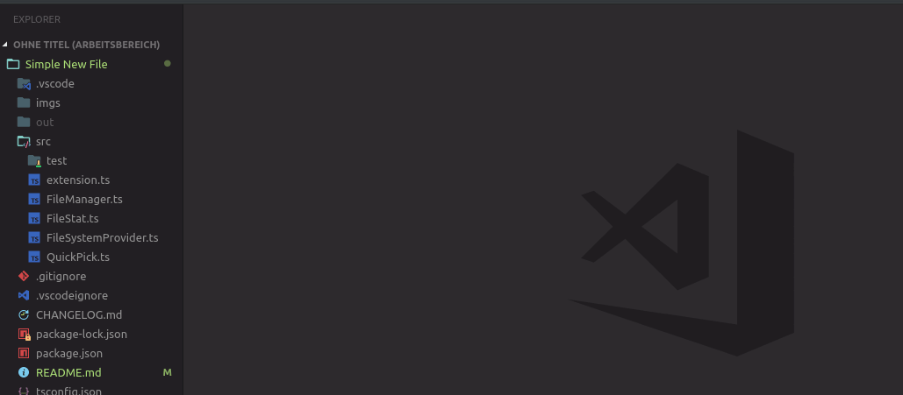

# Simple New File

Inspired by the great [extension](https://github.com/Osmose/advanced-open-file) for Atom.

Creating new files via the sidebar can get quite tedious. This extension aims to make creating files or directories as simple as possible via the command palette. Has autocompletion and also works with multiple workspaces!



## Installation

Before installing make sure you are running a version of VSCode > 1.26.0 as this extension uses the QuickPick Extension API shipped with 1.26.0.

The recommended way of installing is

1. Choose **Extensions** from the menu (<kbd>CTRL</kbd>+<kbd>SHIFT</kbd>+<kbd>X</kbd>)
2. Search for "simple new file"
3. Click **Install**
4. Click **Reload** to reload the window

And that's it, you're done!

## Creating files / directories

Pressing <kbd>CTRL</kbd>+<kbd>ALT</kbd>+<kbd>N</kbd> brings up a prompt where you can enter a path to a file. The file will be opened if it already exists otherwise a new file will be created along with all its parent directories.

Typing in `path/to/a/new/file` will result in the following tree structure.

```
path
├── to
│   ├── a
│   │   └── new.file
```

Paths can also have relative parts: `path/to/../a/new.file` will get you
```
path
├── a
│   └── new.file
```

Paths are being treated as relative to the current open file. You can also specify an absolute path by beginning with `/`. `/path/to...` for example will create files relative to the root of your workspace.

### Directories

You can also create directories by putting a `/` at the ending of a path. `path/to/dir/` will create `dir` as a directory instead of a file.

### Autocompletion

By selecting a directory from the list, the extension does autocomplete the input for you. Beware however, as this does not work by pressing <kbd>TAB</kbd>, the process is more like "selecting an item and pressing <kbd>RETURN</kbd>". This is due to limitations from the VSCode Extension API and may be improved in future versions of this extensions as the Extension API is expanded.

## Known Caveats

- There is currently no way to get your installed icon theme to show up in the list. Therefore only GitHub's Octicons are supported.
- The API for the QuickPick does not allow for custom sorting while typing. The items inside the list may be placed in an incorrect order, that is not "folders first, files second".
